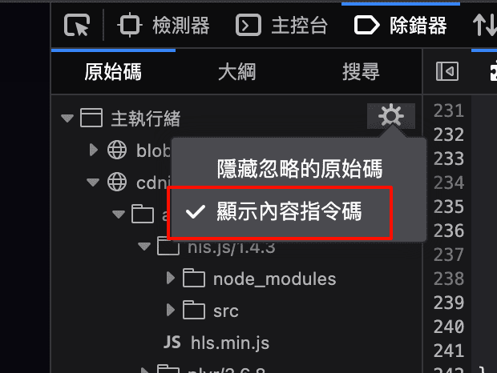

# 插件列表

- proxy: 代理
- translate: 划词翻译
- work: 工作相关-仅供个人

# 调试

## 无法调试

> 说明: debugger关键字无效, 点击控制台输出不能跳转到除错器

打开如下开关




# 安装说明

打包插件需在manifest.json中添加配置

```json
"browser_specific_settings": {
    "gecko": {
        // 邮箱 或 uuid
        "id": "pluginname@61linux.com",
        "strict_min_version": "54.0"
    }
},
```

步骤：

1. 进入插件目录(manifest.json 同级) `cd work`, 执行 `zip -r -FS work.zip *`
2. 非开发版firefox需要提交插件市场校验
3. 开发版firefox
    1. 浏览器打开 `about:config`
    2. 设置 `xpinstall.signatures.required=false`
    3. 安装本地插件 *.zip

# 文档

## manifest.json

https://developer.mozilla.org/zh-CN/docs/Mozilla/Add-ons/WebExtensions/manifest.json

# config

- 禁用alt快捷键: about:config -> ui.key.menuAccessKey
- 开发版 关闭插件签名校验: about:config -> xpinstall.signatures.required=false

# publish plugin

- 右上角三横线打开菜单
- 更多工具
- 面向开发者的扩展
- ...